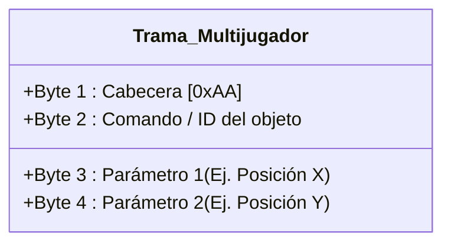
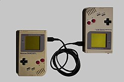
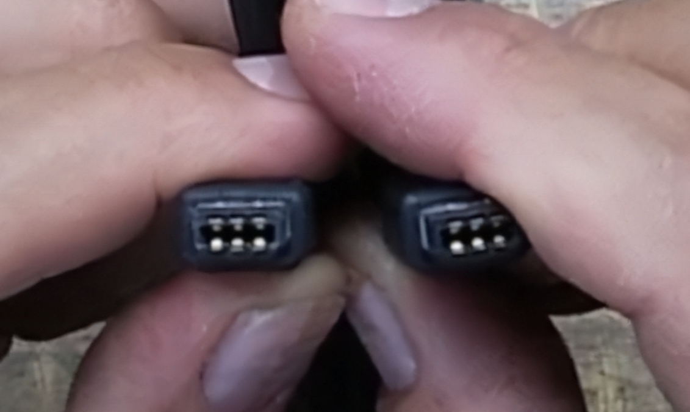
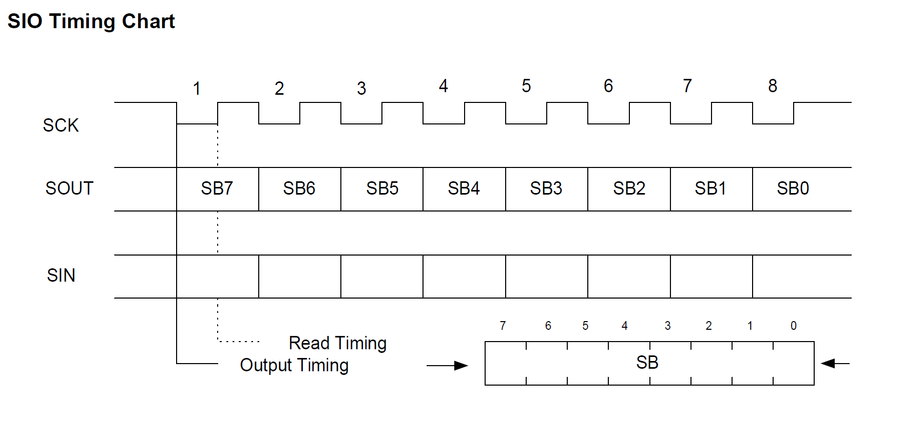
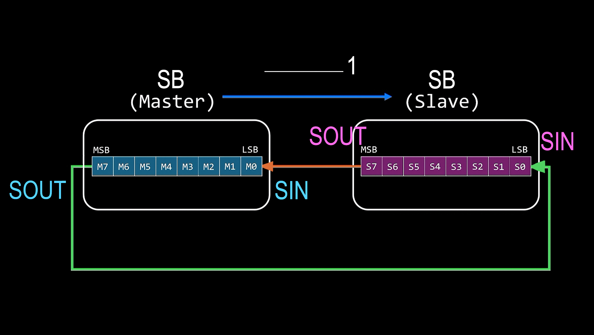
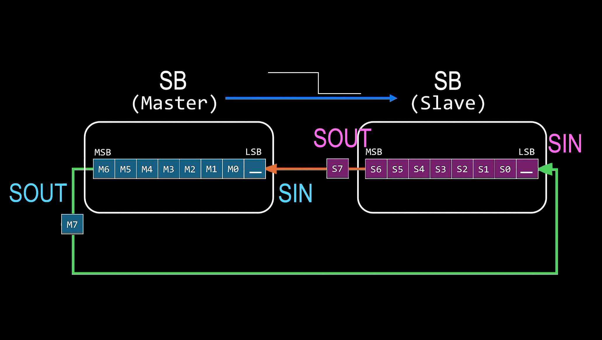
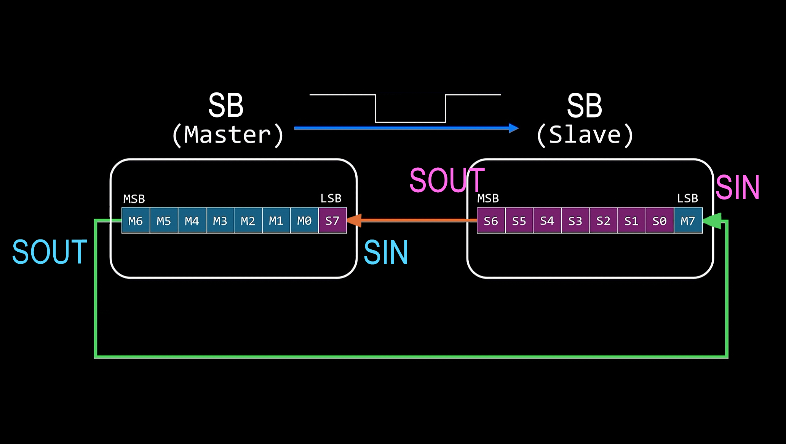
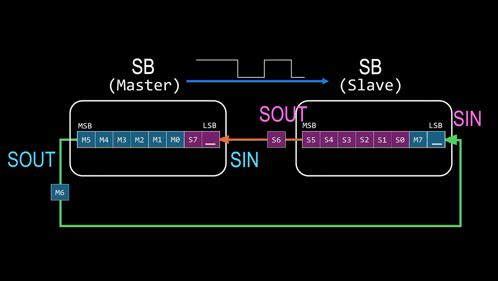
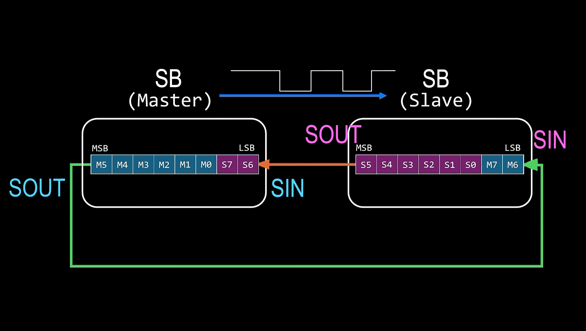

# Protocolo de comunicación

## 1. Objetivo

Definir cómo se van a comunicar las dos FPGAs para el modo multijugador. 

La idea es usar una arquitectura parecida al Cable Link de las consolas clásicas (como la Game Boy). Es un esquema **Maestro - Esclavo**, donde una consola (la Maestra) genera el reloj y controla los tiempos, mientras que la otra (la Esclava) simplemente responde. Todo esto para lograr que los datos de los controles y posiciones pasen de una placa a otra en tiempo real a 60 FPS, sin que los jugadores sientan *lag*.

## 2. Comunicación mediante SIO (Serial I/O)

### 2.1 Conexión física

Para este módulo vamos a implementar un protocolo SIO síncrono. Como es una conexión directa de placa a placa, simplificamos el cableado a solo cuatro líneas entre los pines de expansión:

* **SC (Serial Clock):** Es el reloj. Solo lo genera la FPGA Maestra.
* **SO (Serial Out):** Por aquí salen los datos.
* **SI (Serial In):** Por aquí entran los datos.
* **GND:** Tierra común (indispensable para que ambas placas tengan la misma referencia de voltaje y no haya ruido).

La conexión va cruzada: el pin `SO` de la Maestra se conecta al `SI` de la Esclava, y el `SO` de la Esclava va al `SI` de la Maestra. La señal del reloj `SC` solo viaja en un sentido (Maestra → Esclava).

**Figura 1. Conexión física entre las consolas.**


Para que ninguno de los dos jugadores tenga ventaja de latencia, la comunicación es **full-duplex síncrona** (ambos mandan y reciben al mismo tiempo).

### 2.2 Funcionamiento: El Shift Register

Lo más importante aquí para el diseño en hardware (Verilog) es que no vamos a armar un transmisor asíncrono complejo. En el fondo, esto es simplemente un **Registro de Desplazamiento (Shift Register) de 8 bits** instanciado en cada placa, funcionando como un espejo.

El intercambio se hace como un trueque simultáneo:
1. El procesador de cada FPGA carga el byte que quiere mandar en su registro.
2. La FPGA Maestra arranca la transmisión generando exactamente 8 pulsos por el cable de reloj `SC`.
3. En cada **bajada** del reloj, las dos FPGAs sacan un bit por `SO`.
4. En cada **subida** del reloj, las dos FPGAs leen lo que haya en `SI` y lo guardan.
5. Cuando se acaban los 8 pulsos, el reloj se detiene. En ese momento, ya se intercambió un byte completo entre las dos consolas.

**Figura 2. Proceso de intercambio de datos simultáneo (RTL).**


### 2.3 Diferencias con el SPI normal

Aunque este diseño se parece mucho al protocolo SPI de toda la vida, usamos la lógica de Nintendo por dos razones prácticas para el proyecto:

* **No usamos pin de selección (CS):** Como solo vamos a conectar dos consolas, no necesitamos un cable extra para "despertar" a la Esclava. Su hardware siempre está listo y reacciona de inmediato apenas siente que el reloj `SC` se empieza a mover.
* **Intercambio 1 a 1:** El SPI comercial permite mandar ráfagas sueltas. Nuestro diseño obliga a que si la Maestra manda un byte, recibe otro de la Esclava en el mismo ciclo, sí o sí.

## 3. Estructura de la Trama (Payload)

Como el hardware intercambia de a 1 byte (8 bits) a la vez, desde el código en C vamos a agrupar la información del juego en paquetes fijos de **4 bytes**. La Maestra mandará a activar el hardware 4 veces seguidas por cada actualización de pantalla. Ojo: por aquí no mandamos gráficos, solo posiciones y variables de estado para no saturar la conexión.

| Byte | Función | Descripción | Ejemplo (Hex) |
| :--- | :--- | :--- | :--- |
| **1** | Cabecera (Start) | Byte fijo para saber que empieza un paquete válido. | `0xAA` |
| **2** | Comando / ID | Indica de qué es el dato (jugador, pelota, pausa, etc.). | `0x01` |
| **3** | Dato 1 | Primer parámetro (ej. Coordenada X, o un botón presionado). | `0x2F` |
| **4** | Dato 2 | Segundo parámetro (ej. Coordenada Y, o estado). | `0x78` |

**Figura 4. Visualización del paquete de datos.**



Para evitar que los objetos salten por la pantalla si un dato llega mal, revisamos el primer byte. Si el paquete llega y no empieza con la cabecera `0xAA`, el código en C asume que hubo un error y descarta el paquete completo.

## 4. Comandos y la solución al "Polling"

El mayor reto de usar Maestro-Esclavo es que la FPGA del Jugador 2 (Esclava) no puede avisar por sí sola cuando oprimen un botón, porque no tiene control del reloj para iniciar la transmisión.

Para resolver esto sin que el Jugador 2 sienta *lag*, la Maestra va a hacer *polling* (sondeo continuo). Unas 60 veces por segundo, antes de dibujar cada frame, la Maestra le envía un comando a la Esclava solo para forzarla a devolver el estado de sus botones y coordenadas. 

En el Byte 2 usaremos estos comandos básicos:
* **`0x01`:** Posición o estado del Jugador Local.
* **`0x02`:** Posición o estado del Jugador Rival.
* **`0x03`:** Coordenadas de objetos compartidos (como la pelota).
* **`0xF0`:** Eventos del juego (inicio, pausa, Game Over).
* **`0xF1`:** Mensaje de conexión (*handshake*) para verificar que el cable está puesto antes de arrancar.

## 5. Pendientes técnicos

* Revisar los requerimientos del juego final para ver si nos alcanzan 8 bits por coordenada, o si toca ajustar el tamaño de la trama.
* Escribir el código en Verilog para el divisor de reloj en la Maestra, tomando el reloj base de la tarjeta para sacar una señal `SC` estable (por ejemplo, a unos 100 kHz).
* Diseñar la máquina de estados del Shift Register para que cuadre exactamente con las subidas y bajadas del reloj.
* Mapear las direcciones de memoria en el procesador para poder leer y escribir los datos desde C.
* Armar el `while(1)` en el firmware de la Maestra para que haga el *polling* de la Esclava en cada ciclo del juego.
* Hacer un *Testbench* en GTKWave conectando una Maestra y una Esclava simuladas. Hay que verificar que los 8 ciclos de reloj se cumplan perfecto y la línea quede estable antes de probarlo físicamente en las placas.
  
## 6. Coordinación e Impacto en otros módulos

Al cambiar la arquitectura a un modelo Maestro-Esclavo (SIO), nuestro módulo interactúa de forma diferente con el resto del sistema. A continuación, detallamos cómo podríamos afectar a los demás grupos de desarrollo y el plan de mitigación para cada caso:

### 6.1 Equipo de `software_juegos`
*   **Dificultad:** En un diseño normal *Peer-to-Peer*, el código del juego sería exactamente igual en ambas FPGAs. Ahora, la lógica cambia: la consola Maestra tiene que estar pidiendo datos (haciendo *polling*), mientras que la Esclava solo responde. Si les pasamos el hardware así en crudo, les vamos a complicar el ciclo de programación del juego.
*   **Solución:** Les vamos a entregar una librería en C (un archivo `.h`) con funciones de alto nivel ya listas (ej. `sincronizar_multijugador()`). La idea es que ellos solo llamen a esa función en su ciclo principal y nuestra librería se encargue por debajo de saber quién es el Maestro y quién el Esclavo, entregándoles las variables de las coordenadas ya listas para usar.

### 6.2 Equipos de periféricos (`nes_controller.v`, `ps2_keyboard.v`, `ps2_mouse`)
*   **Dificultad:** Nuestro módulo SIO es el puente que manda los botones presionados o las posiciones del mouse al otro jugador. Si el grupo de NES o teclado decide cambiar el orden de los datos (por ejemplo, que el botón "A" ya no es el bit 0 sino el bit 2), la consola rival va a interpretar comandos erróneos y arruinará la partida.
*   **Solución:** Vamos a definir un "Contrato de Datos" estricto. Acordaremos un mapa de bits fijo e inamovible para el Byte 3 y Byte 4 de nuestra trama. Nuestro módulo SIO no va a procesar qué botón se oprimió, solo tomará el registro en crudo que ellos nos pasen desde su hardware y lo mandaremos al otro lado de forma transparente.

### 6.3 Equipos visuales (`Display-Driver`, `MAX7219-`)
*   **Dificultad:** El protocolo SIO detiene al procesador mientras genera los 8 pulsos de reloj del intercambio. Si esta pequeña pausa ocurre justo en el momento en que la FPGA está dibujando la pantalla o la matriz LED, se pueden generar parpadeos (*flickering*) o cortes en la imagen (*tearing*).
*   **Solución:** Coordinaremos con ellos y con los de software para que la función de actualizar el multijugador se llame exclusivamente durante el *Vertical Blanking* (VBLANK). Este es el milisegundo exacto en el que la pantalla termina de dibujar un cuadro y el sistema está inactivo, evitando así cualquier interrupción visual.

### 6.4 Equipo de `UART` y otros protocolos (`I2C_Master`, `spi_flash_ctrl`)
*   **Dificultad:** Todos los módulos de comunicación necesitan conectar cables físicos a los pines de expansión de la FPGA. Si no nos hablamos, podríamos terminar asignando los mismos pines en el archivo de restricciones (`.cst`) para el TX del UART o el I2C, y para el reloj `SC` de nuestro SIO, causando un cortocircuito lógico.
*   **Solución:** Al abandonar nosotros el protocolo UART y usar SIO, ya liberamos carga en el bus y evitamos duplicar módulos. Para solucionar el tema físico, crearemos un documento compartido del "Pinout" general del proyecto para reservar oficialmente nuestros 3 pines físicos (`SC`, `SI`, `SO`) y asegurar que ningún otro grupo los intente usar.


## 7. Funcionamiento del SIO: intercambio de datos bit a bit

### 7.1 Conexión entre las consolas Game Boy

La comunicación serial del Game Boy se realiza mediante un enlace físico entre las dos consolas. En el caso del sistema multijugador, las dos Game Boy se conectan mediante el Cable Link, permitiendo el intercambio de información entre ambas.



**Figura 5.** Dos consolas Game Boy conectadas mediante el Cable Link.

El Cable Link permite establecer la conexión eléctrica necesaria para la comunicación serial entre las dos consolas. El conector utilizado dispone de varios contactos, cada uno asociado a una señal del sistema de comunicación.



**Figura 6.** Contactos del Cable Link utilizados para establecer la conexión entre las consolas.

---

### 7.2 Diagrama de tiempos del SIO

El funcionamiento de la comunicación serial puede observarse mediante el diagrama de tiempos del SIO. En este diagrama se muestra la relación entre la señal de reloj `SCK`, las señales de salida `SOUT` y entrada `SIN`, y el registro de desplazamiento `SB`.



**Figura 7.** Diagrama de tiempos de la comunicación serial SIO.

En la comunicación mostrada en el diagrama, la señal `SCK` comienza en nivel alto. El intercambio de cada bit se realiza mediante dos flancos del reloj:

- **Flanco de bajada:** el contenido del registro `SB` se desplaza hacia la izquierda y el bit más significativo (`SB7`) se presenta en la salida `SOUT`.
- **Flanco de subida:** se lee el valor presente en la entrada `SIN` y este se incorpora en la posición `SB0` del registro.

Este proceso se repite hasta completar los ocho bits de la transferencia.

---

### 7.3 Estado inicial de los registros

Antes de comenzar la transferencia, cada dispositivo posee un registro `SB` de 8 bits que contiene el dato que desea transmitir.

Para representar el intercambio entre las dos FPGA, se pueden identificar los bits del registro del Master como:

`M7, M6, M5, M4, M3, M2, M1, M0`

y los bits del registro del Slave como:

`S7, S6, S5, S4, S3, S2, S1, S0`.

En el estado inicial, ambos registros contienen los datos que cada FPGA desea transmitir.



**Figura 8.** Estado inicial de los registros de desplazamiento y de las señales de comunicación.

En este punto todavía no se ha producido ningún desplazamiento. El reloj `SCK` se encuentra en nivel alto y los bits más significativos de ambos registros (`M7` y `S7`) serán los primeros bits que participarán en el intercambio.

---

### 7.4 Primer flanco de bajada: desplazamiento y salida

Cuando la señal `SCK` cambia de nivel alto a nivel bajo se produce el primer flanco de bajada.

En este momento, cada registro `SB` se desplaza una posición hacia la izquierda. El bit más significativo de cada registro se presenta en la salida correspondiente.

Por lo tanto:

- `M7` sale del registro del Master y se presenta en `SOUT`.
- `S7` sale del registro del Slave y se presenta en su `SOUT`.
- Los demás bits se desplazan una posición hacia la izquierda.
- La posición `SB0` queda disponible para recibir el bit proveniente del otro dispositivo.



**Figura 9.** Primer flanco de bajada: desplazamiento de los registros y presentación de los bits más significativos en las líneas de salida.

Después de este desplazamiento, los bits que estaban en `M6` y `S6` pasan a ocupar las posiciones `M7` y `S7`, respectivamente. Al mismo tiempo, los bits `M7` y `S7` se encuentran disponibles en las líneas de comunicación.

---

### 7.5 Primer flanco de subida: recepción del bit

Después del flanco de bajada, la señal `SCK` vuelve a cambiar de nivel bajo a nivel alto.

En este flanco de subida, cada dispositivo lee el valor presente en su entrada `SIN`. El bit recibido se incorpora en la posición `SB0` que había quedado disponible durante el desplazamiento anterior.

De esta manera:

- El Master recibe el bit que el Slave había colocado en su salida.
- El Slave recibe el bit que el Master había colocado en su salida.
- Ambos dispositivos realizan la recepción simultáneamente.



**Figura 10.** Primer flanco de subida: lectura de los bits presentes en las entradas y almacenamiento en `SB0`.

Por lo tanto, la transferencia es bidireccional. Mientras el Master transmite un bit al Slave, el Slave transmite simultáneamente un bit al Master.

---

### 7.6 Segundo flanco de bajada

Una vez realizada la recepción del primer bit, comienza el siguiente ciclo de transferencia.

Cuando `SCK` vuelve a pasar de nivel alto a nivel bajo, los registros se desplazan nuevamente una posición hacia la izquierda. El siguiente bit que se encontraba en cada registro pasa a ocupar la posición de salida.

En este segundo ciclo, los bits que participan en la transferencia son los que originalmente correspondían a `M6` y `S6`.



**Figura 11.** Segundo flanco de bajada: nuevo desplazamiento de los registros y presentación del siguiente bit.

El procedimiento es el mismo que en el primer ciclo: se desplazan los registros, se presenta el siguiente bit en la salida y se prepara nuevamente la posición `SB0` para recibir el bit proveniente del otro dispositivo.

---

### 7.7 Segundo flanco de subida

Después del segundo flanco de bajada, la señal `SCK` vuelve a pasar de nivel bajo a nivel alto.

En este flanco se realiza nuevamente la lectura de las entradas `SIN`. Los bits presentes en las líneas de comunicación son incorporados en las posiciones `SB0` de los respectivos registros.



**Figura 12.** Segundo flanco de subida: recepción del segundo bit intercambiado.

A partir de este punto, el mismo procedimiento continúa para los bits restantes. Cada ciclo está compuesto por un flanco de bajada, en el que se realiza el desplazamiento y se presenta el siguiente bit, y un flanco de subida, en el que se recibe el bit proveniente del otro dispositivo.

---

### 7.8 Intercambio completo de un byte

El procedimiento anterior se repite hasta completar los ocho bits de los registros. Los bits se intercambian en el siguiente orden:

```text
Ciclo 1: M7 ↔ S7
Ciclo 2: M6 ↔ S6
Ciclo 3: M5 ↔ S5
Ciclo 4: M4 ↔ S4
Ciclo 5: M3 ↔ S3
Ciclo 6: M2 ↔ S2
Ciclo 7: M1 ↔ S1
Ciclo 8: M0 ↔ S0
