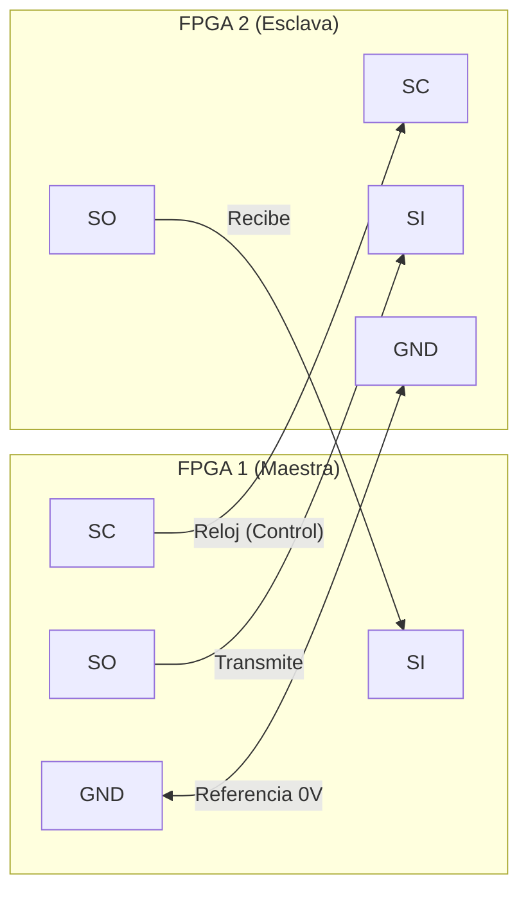
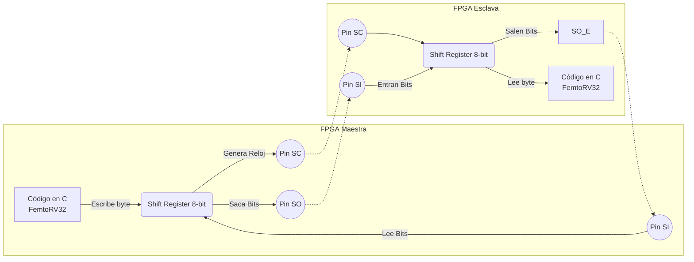
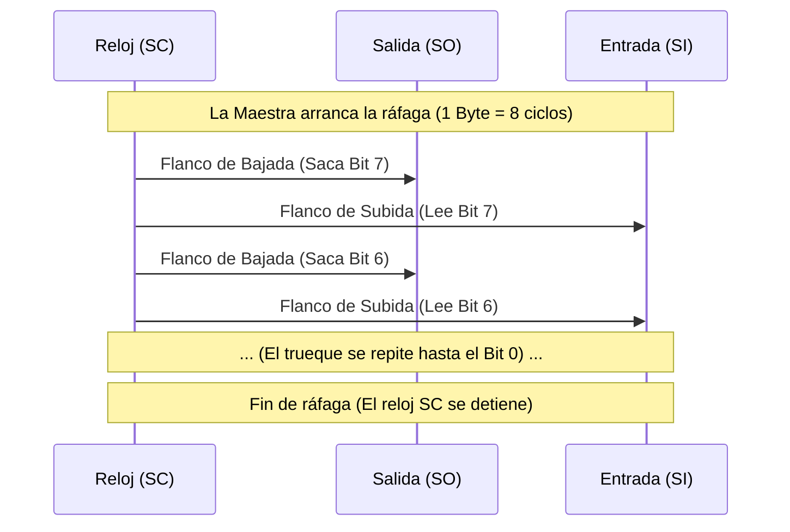
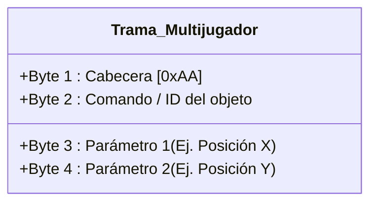

# Protocolo de comunicación

## 1. Objetivo

Definir cómo se van a comunicar las dos FPGAs para el modo multijugador. 

La idea es usar una arquitectura parecida al Cable Link de las consolas clásicas (como la Game Boy). Es un esquema **Maestro - Esclavo**, donde una consola (la Maestra) genera el reloj y controla los tiempos, mientras que la otra (la Esclava) simplemente responde. Todo esto para lograr que los datos de los controles y posiciones pasen de una placa a otra en tiempo real a 60 FPS, sin que los jugadores sientan *lag*.

## 2. Comunicación mediante SIO (Serial I/O)

### 2.1 Conexión física

Para este módulo vamos a implementar un protocolo SIO síncrono. Como es una conexión directa de placa a placa, simplificamos el cableado a solo cuatro líneas entre los pines de expansión:

* **SC (Serial Clock):** Es el reloj. Solo lo genera la FPGA Maestra.
* **SO (Serial Out):** Por aquí salen los datos.
* **SI (Serial In):** Por aquí entran los datos.
* **GND:** Tierra común (indispensable para que ambas placas tengan la misma referencia de voltaje y no haya ruido).

La conexión va cruzada: el pin `SO` de la Maestra se conecta al `SI` de la Esclava, y el `SO` de la Esclava va al `SI` de la Maestra. La señal del reloj `SC` solo viaja en un sentido (Maestra → Esclava).

**Figura 1. Conexión física entre las consolas.**

Para que ninguno de los dos jugadores tenga ventaja de latencia, la comunicación es **full-duplex síncrona** (ambos mandan y reciben al mismo tiempo).

### 2.2 Funcionamiento: El Shift Register

Lo más importante aquí para el diseño en hardware (Verilog) es que no vamos a armar un transmisor asíncrono complejo. En el fondo, esto es simplemente un **Registro de Desplazamiento (Shift Register) de 8 bits** instanciado en cada placa, funcionando como un espejo.

El intercambio se hace como un trueque simultáneo:
1. El procesador de cada FPGA carga el byte que quiere mandar en su registro.
2. La FPGA Maestra arranca la transmisión generando exactamente 8 pulsos por el cable de reloj `SC`.
3. En cada **bajada** del reloj, las dos FPGAs sacan un bit por `SO`.
4. En cada **subida** del reloj, las dos FPGAs leen lo que haya en `SI` y lo guardan.
5. Cuando se acaban los 8 pulsos, el reloj se detiene. En ese momento, ya se intercambió un byte completo entre las dos consolas.

**Figura 2. Proceso de intercambio de datos simultáneo (RTL).**

**Figura 3. Diagrama de tiempos por cada ráfaga de reloj.**

### 2.3 Diferencias con el SPI normal

Aunque este diseño se parece mucho al protocolo SPI de toda la vida, usamos la lógica de Nintendo por dos razones prácticas para el proyecto:

* **No usamos pin de selección (CS):** Como solo vamos a conectar dos consolas, no necesitamos un cable extra para "despertar" a la Esclava. Su hardware siempre está listo y reacciona de inmediato apenas siente que el reloj `SC` se empieza a mover.
* **Intercambio 1 a 1:** El SPI comercial permite mandar ráfagas sueltas. Nuestro diseño obliga a que si la Maestra manda un byte, recibe otro de la Esclava en el mismo ciclo, sí o sí.

## 3. Estructura de la Trama (Payload)

Como el hardware intercambia de a 1 byte (8 bits) a la vez, desde el código en C vamos a agrupar la información del juego en paquetes fijos de **4 bytes**. La Maestra mandará a activar el hardware 4 veces seguidas por cada actualización de pantalla. Ojo: por aquí no mandamos gráficos, solo posiciones y variables de estado para no saturar la conexión.

| Byte | Función | Descripción | Ejemplo (Hex) |
| :--- | :--- | :--- | :--- |
| **1** | Cabecera (Start) | Byte fijo para saber que empieza un paquete válido. | `0xAA` |
| **2** | Comando / ID | Indica de qué es el dato (jugador, pelota, pausa, etc.). | `0x01` |
| **3** | Dato 1 | Primer parámetro (ej. Coordenada X, o un botón presionado). | `0x2F` |
| **4** | Dato 2 | Segundo parámetro (ej. Coordenada Y, o estado). | `0x78` |

**Figura 4. Visualización del paquete de datos.**

Para evitar que los objetos salten por la pantalla si un dato llega mal, revisamos el primer byte. Si el paquete llega y no empieza con la cabecera `0xAA`, el código en C asume que hubo un error y descarta el paquete completo.

## 4. Comandos y la solución al "Polling"

El mayor reto de usar Maestro-Esclavo es que la FPGA del Jugador 2 (Esclava) no puede avisar por sí sola cuando oprimen un botón, porque no tiene control del reloj para iniciar la transmisión.

Para resolver esto sin que el Jugador 2 sienta *lag*, la Maestra va a hacer *polling* (sondeo continuo). Unas 60 veces por segundo, antes de dibujar cada frame, la Maestra le envía un comando a la Esclava solo para forzarla a devolver el estado de sus botones y coordenadas. 

En el Byte 2 usaremos estos comandos básicos:
* **`0x01`:** Posición o estado del Jugador Local.
* **`0x02`:** Posición o estado del Jugador Rival.
* **`0x03`:** Coordenadas de objetos compartidos (como la pelota).
* **`0xF0`:** Eventos del juego (inicio, pausa, Game Over).
* **`0xF1`:** Mensaje de conexión (*handshake*) para verificar que el cable está puesto antes de arrancar.

## 5. Pendientes técnicos

* Revisar los requerimientos del juego final para ver si nos alcanzan 8 bits por coordenada, o si toca ajustar el tamaño de la trama.
* Escribir el código en Verilog para el divisor de reloj en la Maestra, tomando el reloj base de la tarjeta para sacar una señal `SC` estable (por ejemplo, a unos 100 kHz).
* Diseñar la máquina de estados del Shift Register para que cuadre exactamente con las subidas y bajadas del reloj.
* Mapear las direcciones de memoria en el procesador para poder leer y escribir los datos desde C.
* Armar el `while(1)` en el firmware de la Maestra para que haga el *polling* de la Esclava en cada ciclo del juego.
* Hacer un *Testbench* en GTKWave conectando una Maestra y una Esclava simuladas. Hay que verificar que los 8 ciclos de reloj se cumplan perfecto y la línea quede estable antes de probarlo físicamente en las placas.
  
## 6. Coordinación e Impacto en otros módulos

Al cambiar la arquitectura a un modelo Maestro-Esclavo (SIO), nuestro módulo interactúa de forma diferente con el resto del sistema. A continuación, detallamos cómo podríamos afectar a los demás grupos de desarrollo y el plan de mitigación para cada caso:

### 6.1 Equipo de `software_juegos`[cite: 1]
*   **Dificultad:** En un diseño normal *Peer-to-Peer*, el código del juego sería exactamente igual en ambas FPGAs[cite: 1]. Ahora, la lógica cambia: la consola Maestra tiene que estar pidiendo datos (haciendo *polling*), mientras que la Esclava solo responde[cite: 1]. Si les pasamos el hardware así en crudo, les vamos a complicar el ciclo de programación del juego[cite: 1].
*   **Solución:** Les vamos a entregar una librería en C (un archivo `.h`) con funciones de alto nivel ya listas (ej. `sincronizar_multijugador()`)[cite: 1]. La idea es que ellos solo llamen a esa función en su ciclo principal y nuestra librería se encargue por debajo de saber quién es el Maestro y quién el Esclavo, entregándoles las variables de las coordenadas ya listas para usar[cite: 1].

### 6.2 Equipos de periféricos (`nes_controller.v`, `ps2_keyboard.v`, `ps2_mouse`)[cite: 1]
*   **Dificultad:** Nuestro módulo SIO es el puente que manda los botones presionados o las posiciones del mouse al otro jugador[cite: 1]. Si el grupo de NES o teclado decide cambiar el orden de los datos (por ejemplo, que el botón "A" ya no es el bit 0 sino el bit 2), la consola rival va a interpretar comandos erróneos y arruinará la partida[cite: 1].
*   **Solución:** Vamos a definir un "Contrato de Datos" estricto[cite: 1]. Acordaremos un mapa de bits fijo e inamovible para el Byte 3 y Byte 4 de nuestra trama[cite: 1]. Nuestro módulo SIO no va a procesar qué botón se oprimió, solo tomará el registro en crudo que ellos nos pasen desde su hardware y lo mandaremos al otro lado de forma transparente[cite: 1].

### 6.3 Equipos visuales (`Display-Driver`, `MAX7219-`)[cite: 1]
*   **Dificultad:** El protocolo SIO detiene al procesador mientras genera los 8 pulsos de reloj del intercambio[cite: 1]. Si esta pequeña pausa ocurre justo en el momento en que la FPGA está dibujando la pantalla o la matriz LED, se pueden generar parpadeos (*flickering*) o cortes en la imagen (*tearing*)[cite: 1].
*   **Solución:** Coordinaremos con ellos y con los de software para que la función de actualizar el multijugador se llame exclusivamente durante el *Vertical Blanking* (VBLANK)[cite: 1]. Este es el milisegundo exacto en el que la pantalla termina de dibujar un cuadro y el sistema está inactivo, evitando así cualquier interrupción visual[cite: 1].

### 6.4 Equipo de `UART` y otros protocolos (`I2C_Master`, `spi_flash_ctrl`)[cite: 1]
*   **Dificultad:** Todos los módulos de comunicación necesitan conectar cables físicos a los pines de expansión de la FPGA[cite: 1]. Si no nos hablamos, podríamos terminar asignando los mismos pines en el archivo de restricciones (`.cst`) para el TX del UART o el I2C, y para el reloj `SC` de nuestro SIO, causando un cortocircuito lógico[cite: 1].
*   **Solución:** Al abandonar nosotros el protocolo UART y usar SIO, ya liberamos carga en el bus y evitamos duplicar módulos[cite: 1]. Para solucionar el tema físico, crearemos un documento compartido del "Pinout" general del proyecto para reservar oficialmente nuestros 3 pines físicos (`SC`, `SI`, `SO`) y asegurar que ningún otro grupo los intente usar[cite: 1].
