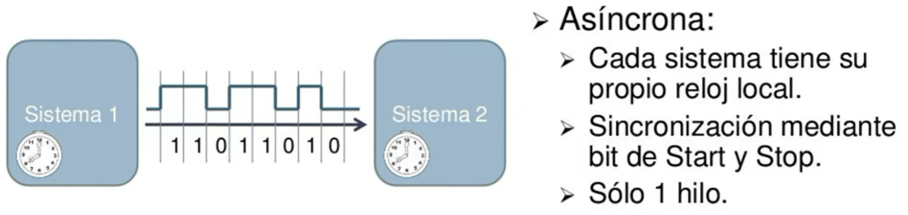
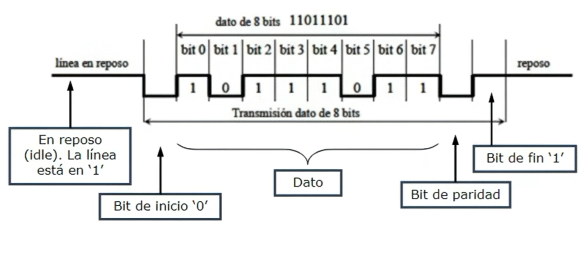

# Protocolo de comunicación

## 1. Objetivo

Establecer las características de la comunicación serial entre las dos FPGA para el modo multijugador. 

La idea de esta interfaz es permitir que las dos consolas (conectadas punto a punto, sin que una sea maestra sobre la otra) intercambien datos en tiempo real para que ambos jugadores estén en la misma partida sin *lag* ni desincronización en la pantalla.

## 2. Comunicación mediante UART

### 2.1 Características generales

Para este módulo usaremos el protocolo UART (Universal Asynchronous Receiver-Transmitter). Para la conexión física solo se necesitan tres líneas entre las placas: **TX** para transmitir, **RX** para recibir y **GND** para compartir la misma referencia de tierra entre ambas FPGAs.

La conexión es cruzada: el pin TX de la FPGA 1 va al pin RX de la FPGA 2, y el TX de la FPGA 2 se conecta al RX de la FPGA 1.

**Figura 1. Conexión entre las dos interfaces UART.**

Como necesitamos que la información del juego viaje en ambos sentidos al mismo tiempo (mientras el Jugador 1 envía su posición, debe recibir la posición del Jugador 2), configuraremos los módulos en modo **full-duplex**.

**Figura 2. Tipos de comunicación según la dirección de transmisión.**

### 2.2 Funcionamiento y Sincronización

UART toma los datos que vienen en paralelo desde el bus del procesador y los convierte en un flujo serial de bits para enviarlos por el cable. En el lado que recibe, el módulo vuelve a armar el dato en paralelo para que el firmware lo pueda leer.

El flujo del dato es el siguiente:

**Datos en paralelo → UART 1 (RTL) → TX → RX → UART 2 (RTL) → Datos en paralelo**

**Figura 3. Proceso de transmisión de datos mediante UART.**

Al ser una comunicación asíncrona no hay una línea de reloj externa que conecte ambas FPGAs. La sincronización se logra ajustando el mismo *Baud Rate* en el código de ambas placas (usaremos **115,200 bps**, que se obtiene dividiendo la frecuencia del reloj base de la FPGA).

Para delimitar los datos, cada envío lleva sus bits de inicio (Start) y parada (Stop).

**Figura 4. Comunicación asíncrona entre dos sistemas.**

La trama básica incluye el bit de inicio, los bits de datos y el bit de parada. Para mantener la transmisión lo más rápida posible y no meter latencia al juego, no usaremos bit de paridad.

**Figura 5. Formato de una trama UART.**

### 2.3 Ventajas para el proyecto

Elegimos UART sobre SPI o I2C por las siguientes razones:

* **Arquitectura sin maestro:** No necesitamos que una FPGA controle el reloj de la otra. Las dos placas son independientes.
* **Cableado sencillo:** Solo se necesitan 3 pines (TX, RX y GND).
* **Sin colisiones:** Al ser full-duplex, cada sentido tiene su propio cable dedicado, así que se evita que los datos choquen.

## 3. Estructura de la Trama de Datos (Payload)

Para evitar que se pierdan datos si un byte se corrompe en el cable, organizamos la información en paquetes fijos de **4 bytes**. No se envían imágenes ni gráficos, solo posiciones y estados.

| Byte | Función | Descripción | Ejemplo (Hex) |
| :--- | :--- | :--- | :--- |
| **1** | Cabecera (Start) | Byte fijo para indicarle al receptor que aquí inicia un mensaje. | `0xAA` |
| **2** | Comando / ID | Indica qué tipo de dato o evento se está enviando. | `0x01` |
| **3** | Dato 1 | Primer parámetro (por ejemplo, coordenada X). | `0x2F` |
| **4** | Dato 2 | Segundo parámetro (por ejemplo, coordenada Y). | `0x78` |

*Nota: Si la FPGA recibe un paquete cuyo primer byte no sea `0xAA`, descarta ese paquete para no mover los elementos a posiciones erróneas.*

## 4. Comandos

Usaremos el Byte 2 para definir qué tipo de mensaje se está mandando entre las FPGAs:

* **`0x01` - Posición Local:** Envía la posición del jugador en la consola actual.
* **`0x02` - Posición Remota:** Actualiza la posición del rival en la pantalla.
* **`0x03` - Elementos neutros:** Coordenadas de objetos compartidos (como la pelota).
* **`0xF0` - Estado del juego:** Eventos como inicio, pausa, punto o fin de partida.
* **`0xF1` - Sincronización:** Mensaje inicial (*handshake*) para verificar que ambas FPGAs están conectadas antes de empezar la partida.

## 5. Pendientes

* Revisar los juegos que vamos a implementar para definir los datos exactos que necesita mandar cada FPGA.
* Definir cuántos bits requerimos por cada variable (posiciones, puntaje, etc.).
* Calcular e implementar el divisor de reloj en Verilog para que ambas FPGAs queden exactamente a 115,200 bps y no pierdan sincronización.
* Diseñar la máquina de estados (FSM) de los módulos transmisor y receptor.
* Escribir las funciones en C en el firmware para empaquetar y leer los 4 bytes usando los registros CSR.
* Hacer las simulaciones en GTKWave para verificar que la transmisión serial responda bien antes de probarlo en el hardware real.
