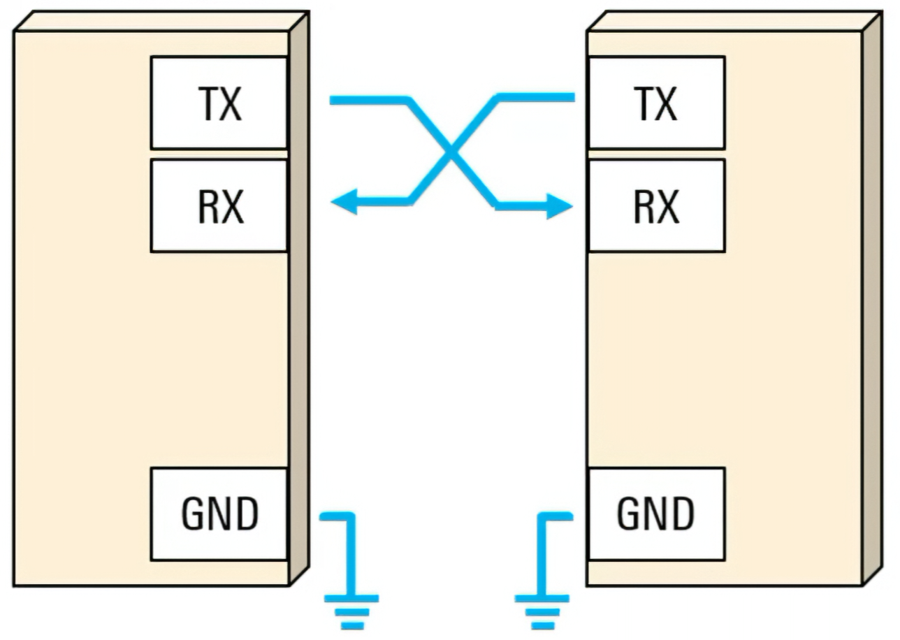
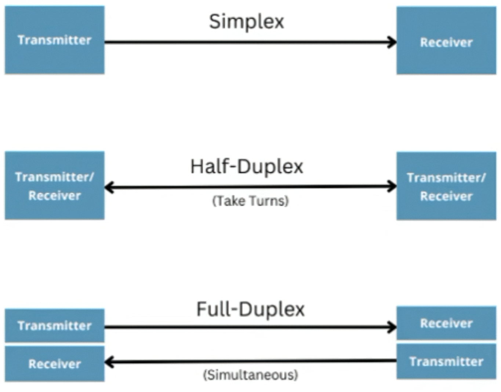
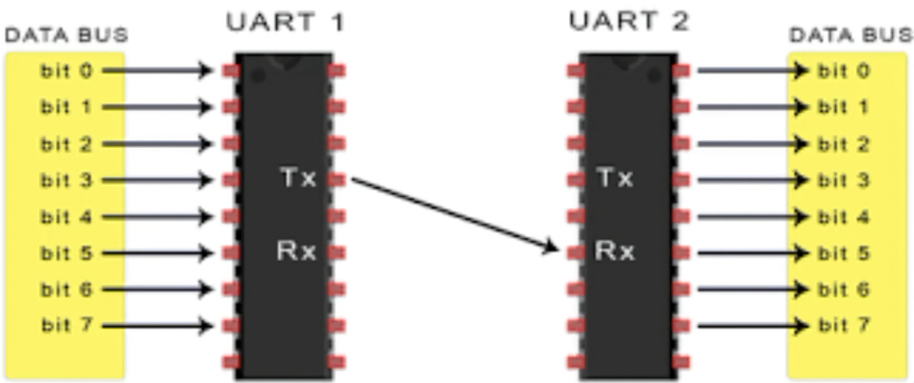

# Protocolo de comunicación

## 1. Objetivo

Establecer las características generales de la comunicación entre las dos FPGA del proyecto multijugador.

La comunicación permitirá que las dos FPGA intercambien la información necesaria para que los jugadores puedan participar en una misma partida.

## 2. Comunicación mediante UART

### 2.1 Características generales

UART (Universal Asynchronous Receiver-Transmitter) es un método de comunicación serial asíncrona. Para la comunicación se utilizan principalmente dos líneas de datos: **TX**, encargada de transmitir la información, y **RX**, encargada de recibirla.

En la conexión entre las dos FPGA, la salida de transmisión de una UART se conecta con la entrada de recepción de la otra. De esta manera, la línea TX de la primera FPGA se conecta con RX de la segunda, y viceversa.

**Figura 1. Conexión entre las dos interfaces UART.**

UART permite realizar comunicación en diferentes sentidos: **simplex**, cuando la información viaja en una sola dirección; **half-duplex**, cuando ambos dispositivos pueden transmitir, pero no al mismo tiempo; y **full-duplex**, cuando ambos dispositivos pueden transmitir y recibir simultáneamente.

**Figura 2. Tipos de comunicación según la dirección de transmisión.**

### 2.2 Funcionamiento

UART permite transmitir información que se encuentra representada en paralelo convirtiéndola en una secuencia de bits que puede viajar de forma serial. En el dispositivo receptor, esta secuencia se recibe y se vuelve a organizar para obtener nuevamente los datos.

En el proyecto, el proceso puede representarse de la siguiente manera:

**Datos en paralelo → UART 1 → TX → RX → UART 2 → Datos en paralelo**

**Figura 3. Proceso de transmisión de datos mediante UART.**

Al tratarse de una comunicación asíncrona, UART no necesita una señal de reloj compartida entre los dos dispositivos. Para identificar el comienzo y el final de cada unidad de información se utilizan bits de inicio y de parada.

### 2.3 Ventajas para el proyecto

Entre las características que hacen conveniente el uso de UART para este proyecto se encuentran:

* No requiere una línea de reloj compartida entre las FPGA.
* Permite establecer diferentes velocidades de transmisión.
* Utiliza una conexión sencilla basada principalmente en las líneas TX y RX.
* Permite comunicación bidireccional cuando se utiliza el modo full-duplex.
* Es apropiado para establecer una comunicación directa entre las dos FPGA.

## 3. Información a compartir

De manera preliminar, se considera necesario intercambiar información relacionada con:

* Acciones de los jugadores.
* Posición de los jugadores.
* Estado de la partida.
* Puntaje.
* Información relacionada con la pelota u otros elementos del juego.

Esta información es preliminar y será revisada después de analizar detalladamente los juegos que serán implementados.

## 4. Comandos

Los comandos serán utilizados para indicar qué tipo de información se está enviando entre las FPGA.

De manera preliminar, se consideran los siguientes tipos:

* Inicio de partida.
* Reinicio de partida.
* Acción del jugador.
* Posición.
* Puntaje.
* Estado del juego.

Los comandos definitivos y la forma en que serán representados se establecerán después de analizar las necesidades específicas de cada juego.

## 5. Pendientes

* Analizar los juegos que serán implementados.
* Determinar qué información necesita cada FPGA.
* Definir los comandos definitivos.
* Definir la cantidad de bits necesaria para cada información.
* Definir la estructura final de los mensajes.

